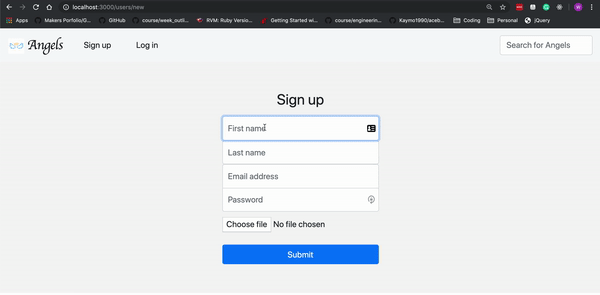
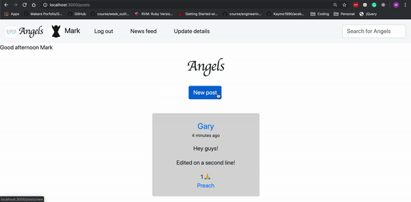
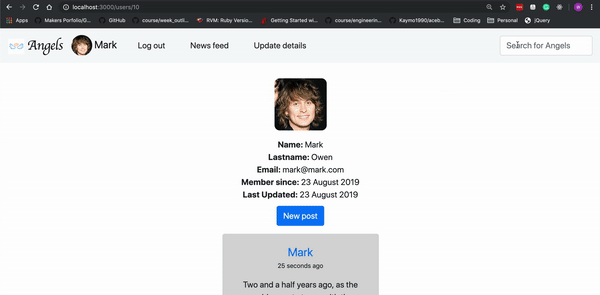

# Charlie's Angels 'Acebook'

## Project Description
This is the Charlie's Angels' attempt at the [Makers Academy](https://makers.tech/) weeks 8-9 [engineering project challenge](https://github.com/makersacademy/course/blob/master/engineering_projects/README.md)

## Useful links
[Our Trello board - for project management](https://trello.com/b/Tw2CEvdT/acebook-charlies-angels)

[Our Google Doc - for monitoring our learning](https://docs.google.com/document/d/15x8yE9Rd4o0w7JL5pWOROjeqIs4rt6D-Ndd3v0kMRf8/edit?usp=sharing)

## How to install and run the project
* Go to your command line/terminal
* Clone this repository
```
git clone git@github.com:Kaymo1990/acebook---CharliesAngels.git
```
* Run bundle install
```
bundle install
```
* Run:
```
rails db:migrate
```
* Run:
```
rails server
```
* In your browser visit http://localhost:3000

## How to run tests on the project
* Having cloned the repo (see above), run:
```
rspec
```

## Some of the Features
1. Sign up


2. Post


3. Searching for other users


## Instructions on how to contribute to the project
* Clone the repo (see above)
* Submit a pull request on github.

## Approach to the project
* Our app was built with Ruby on Rails using TDD (Test Driven Development)
* We worked in an agile way, using daily stand-ups, retros and 2-day sprint planning.
* We mainly used pair programming, swapping pairs regularly so that each team member understood every aspect of the code. Occassionally we used mob-pogramming or solo-work when required.

## Initial User Stories

```
As a user
So I can have an account
I need to sign up
```

```
As a user
So I can use the site
I need to sign in
```

```
As a user
So I can update my status
I need to be able to create posts
```
